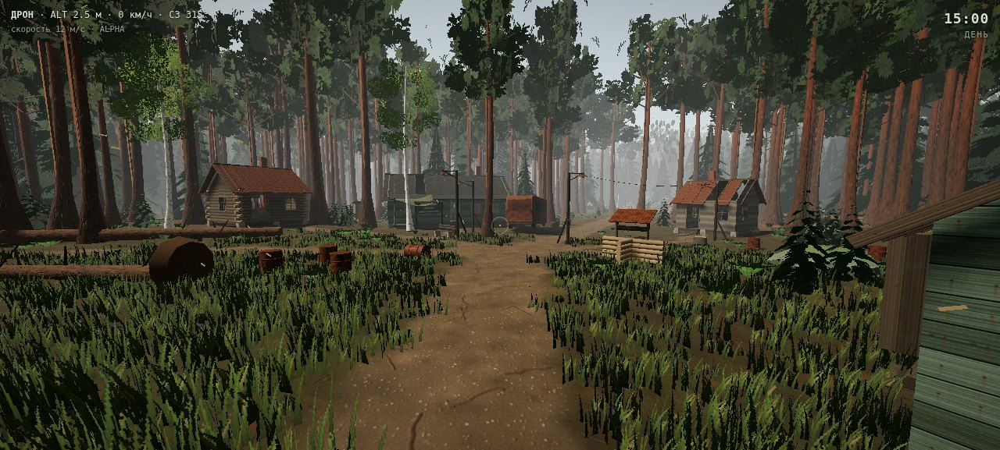
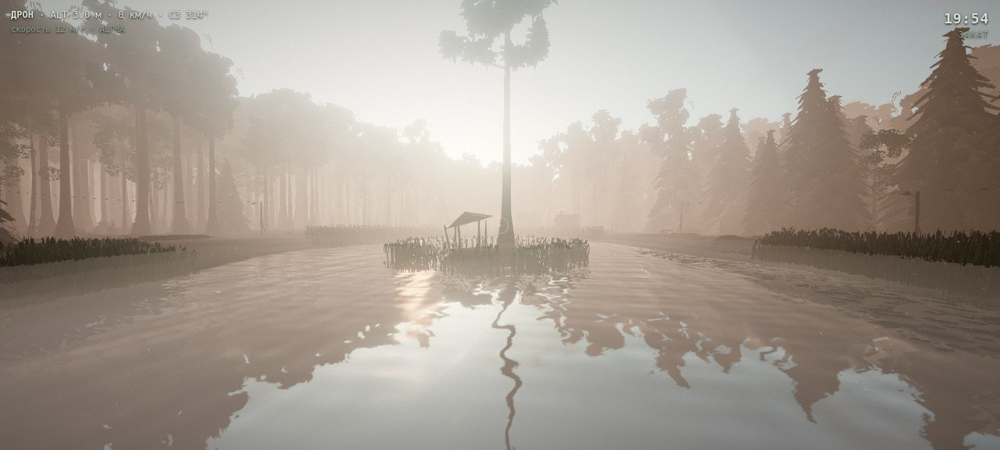
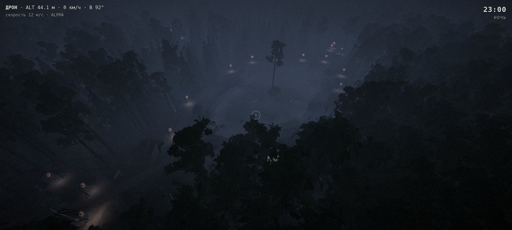

# ТИХИЙ БОР · Forest Front

Лесная карта для шутера на three.js. Здания здесь не главные: весь бой идёт в хвойном лесу.
Заброшенная турбаза у лесного озера оказалась на линии фронта. Вокруг окопы, пустые срубы,
ржавые машины и бочки, по периметру — минное поле. Всё рисуется кодом: процедурные текстуры,
синтезированный звук, без внешних ассетов (с CDN грузится только three.js).






## Запуск

| Вариант | Как |
|---|---|
| Один файл | Открыть `dist/tikhiy_bor.html` двойным щелчком (нужен интернет для three.js с unpkg) |
| Из исходников | `python3 -m http.server 8080` в корне → `http://localhost:8080/` |
| Качество | Кнопки на стартовом экране или `?q=low / medium / high` |
| Сборка | `npm install && npm run build` → `dist/tikhiy_bor.html` |
| Проверка плана | `npm run check`: симметрия, базы, озеро, окопы, минное поле |

## Управление

Камера по умолчанию — **дрон-призрак**: свободный полёт сквозь кроны и постройки. Ниже 0.4 м
над землёй или водой опуститься нельзя. Есть инерция и крен на поворотах.

| Клавиша | Действие |
|---|---|
| Мышь | обзор |
| W A S D | полёт по направлению взгляда / ходьба |
| Space / E, C / Q | вверх / вниз (пешком: прыжок / присесть) |
| Shift, колесо | быстрее; скорость дрона 2–60 м/с |
| ЛКМ | сброс гранаты с дрона / бросок пешком |
| G | дрон ⇄ пешком (коллизии, окопы, вброд и вплавь) |
| F | прожектор дрона / фонарь |
| M | тактическая карта |
| P | кинематографичный облёт карты (WASD — прервать) |
| R | вернуться на базу |
| N, 1–4, T, [ ] | фаза суток, утро/день/закат/ночь, пауза, скорость времени |
| U, V, H, F3 | звук, скрыть интерфейс, подсказки, статистика |

## Логика карты

```
            С (−z)
   ┌──────── МИННОЕ ПОЛЕ ────────┐
   │  Турбаза        ░░░░    [D] │   A — Alpha, юго-запад (−84, 84)
   │    ▪▪  ▪        ░░░░  ≈≈≈   │   D — Delta, северо-восток (84, −84)
   │   ▪  ▪   ╭──кольцо──╮  ≈≈   │   ≈ — передний рубеж (окопы)
 З │        ╭─╯  ОЗЕРО  ╰─╮     │ В
   │        ╰─╮   (о)    ╭─╯    │   (о) — остров с беседкой
   │   ≈≈     ╰──────────╯  ▪ ▪ │   ▪ — постройки
   │ ≈≈≈  ░░░░        ▪  ▪      │
   │ [A]  ░░░░         Кордон   │
   └──────── МИННОЕ ПОЛЕ ────────┘
            Ю (+z)
```

- **Симметрия.** Карта центрально-симметрична: (x, z) → (−x, −z). Рельеф, плотность леса,
  тропы, окопы, воронки, машины, бревна и валуны у Alpha и Delta одинаковые. Отличаются
  только облики построек: турбаза против кордона, автобус против грузовика. Габариты
  при этом совпадают. `npm run check` проверяет симметрию рельефа с точностью до микрокочек.
- **Базы (респауны).** A и D стоят в противоположных углах на пригорках, в 24 м от минного
  поля: с тыла не зайти. На каждой базе флаг команды 5.6×3.5 м на 13-метровой мачте
  (ткань Верле), ДЗОТ, мешки полукругом, склад под маскировочной сетью, генератор с
  прожекторами, бочка-костёр, палатка. Границу зоны возрождения отмечают колышки с вымпелами.
- **Озеро** вытянуто поперёк оси A–D и закрывает лобовой прострел между базами (проверяется
  в `check`). Поэтому бой расходится на три линии: западный и восточный фланги (выходят к
  турбазе и кордону) и берег. У берега камыши с рогозом, кувшинки, мостки с лодкой, в центре
  остров со старой сосной и остовом беседки.
- **Окопы.** Передний рубеж каждой базы — зигзаг с траверсами через 5 м, разрывом под
  центральную тропу, ходом сообщения к базе и блиндажом на крыле. Ещё есть береговые ячейки
  и старые траншеи у турбазы и кордона. Стены обшиты досками, на дне трап, на бруствере
  со стороны противника мешки. Выбраться можно только по пологим аппарелям на концах.
- **Укрытия.** Ржавые «копейки», «буханки», автобус, грузовик, перевёрнутая и сгоревшая
  машины. Бочки подбрасывает взрывом. Ещё укрывают поваленные стволы с корневыми
  выворотами, пни, валуны, поленницы и подрост ёлок: он скрывает от взгляда, но не от пули.
- **Дома.** Срубы и дощатые домики, в которые можно войти: выбитые окна, сорванные двери,
  дырявая кровля, печь, опрокинутый стол. В паре окон ночью теплится свеча.
- **Минное поле** занимает полосу 108–122 м по всему периметру: мины через 2.6 м, растяжки
  ОЗМ, часть ТМ-62 и ПМН вымыта из грунта. Внутреннюю границу обозначают колья с красно-белой
  лентой и таблички «МИНЫ»/«СТОЙ!», внешнюю — колючая проволока и спираль. Шаг на полосу
  означает подрыв и возрождение на своей базе через 3 с. Дрон на бреющем (ниже 1.8 м) цепляет
  растяжку. Старые дороги упираются в поле: разбитые блокпосты, ежи, сгоревшая машина.
- **Свет.** Сутки идут по кругу: утро → день → закат → сумерки → ночь → рассвет, в среднем
  18 минут. Солнце восходит на северо-востоке, заходит на северо-западе. Ночью светит только
  сеть фонарей турбазы: кольцевая, аллеи, мостки, база. Часть ламп разбита, часть моргает.
  Фланги и окопы остаются во тьме, их освещает луна. Лавочки и урны стоят у фонарей.
- **Физика и атмосфера.** Ветер с порывами качает кроны, траву, камыш, ленты и ткань.
  Взрыв посылает по растительности, флагам и бочкам ударную волну, звук приходит с задержкой
  по скорости звука. С крон падает хвоя, в лучах висит пыль, к ночи и на рассвете над озером
  встаёт туман. Слышны птицы, сверчки, сова и далёкая канонада.

## Код

| Файл | Что внутри |
|---|---|
| [`src/world/layout.js`](src/world/layout.js) | план карты: базы, озеро, тропы, окопы, воронки, рельеф |
| [`src/world/forest.js`](src/world/forest.js) | ели, сосны, берёзы (LOD), дальний лес |
| [`src/world/groundcover.js`](src/world/groundcover.js) | трава вокруг камеры, папоротник, черничник, подрост |
| [`src/world/lake.js`](src/world/lake.js) | вода с отражением, камыш, кувшинки, мостки, остров |
| [`src/world/military.js`](src/world/military.js) | окопы, базы, флаги, блиндажи, минное поле |
| [`src/world/buildings.js`](src/world/buildings.js) | срубы, корпус турбазы, баня, кордон |
| [`src/world/vehicles.js`](src/world/vehicles.js), [`props.js`](src/world/props.js) | ржавая техника, бочки с физикой, бревна, валуны |
| [`src/world/lamps.js`](src/world/lamps.js) | фонари, пятна света, пул источников |
| [`src/world/sky.js`](src/world/sky.js) | цикл суток, солнце/луна, звёзды, облака, туман |
| [`src/world/cloth.js`](src/world/cloth.js), [`wind.js`](src/world/wind.js) | ткань, ветер и ударная волна в шейдерах |
| [`src/fx/`](src/fx) | частицы, взрывы, синтез звука, пост-обработка |
| [`src/game/`](src/game) | дрон, пеший режим, мины, облёт, интерфейс |
